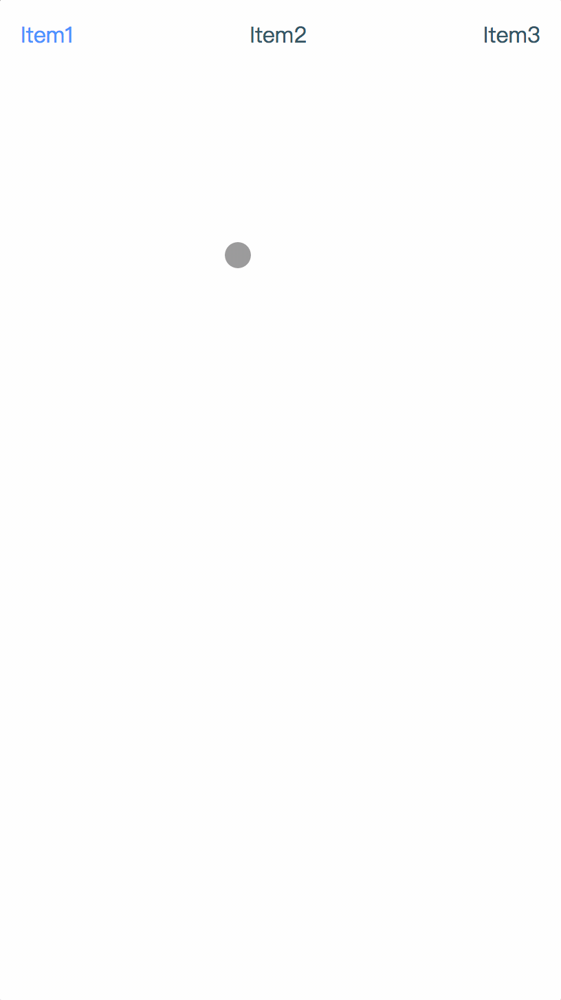

# ScrollBar
a js plugin to make your list scrollable
## Install
install with npm:
```javascript
npm install --save-dev scrollbar.js
```
## Introduction
scrollbar.js is a js plugin to make your list scrollable, you can both drag and click the list to make it scroll, when you release the mouse, it can rebounds to the nearest item.
## Usage
Add the html for your list, notice that the default class `selected` is necessary.
```html
<div class="list-wrapper">
  <ul id="picker">
    <li class="selected">Item1</li>
    <li>Item2</li>
    <li>Item3</li>
  </ul>
</div>
```
Add the style, the list's wrapper should be `position: relative` and `overflow: hidden`, also the `height` should be set otherwise you can not drag the list but click.
```css
.list-wrapper {
  position: relative;
  overflow: hidden;
  height: 42px;
  cursor: -webkit-grab;
}

.list-wrapper ul {
  position: absolute;
  width: 100%;
  display: flex;
  justify-content: space-between;
}

.list-wrapper li {
  color: #2A5561;
  padding: 10px;
}

.list-wrapper ul li.selected {
  color: #448AFF;
}
```
Add the plugin, specify your selector for the list and callback that will trigger when the spring animation ends.
```js
const scrollbar = require('scrollbar.js');
scrollbar({
  selector: '#picker',
  callback: function (index) {
    // the index of the selected item in the list
    console.log(index);
  }
});
```
and you will see:
